<h1 align="center">Daniel Benavides</h1>
<h3 align="center">Backend Developer · El Salvador</h3>

Laravel · Node.js · Express · SQL · REST APIs

  
  &nbsp;
  
  &nbsp;
  

  

---

### 🧠 Sobre mí

Desarrollador backend enfocado en construir **APIs RESTful** robustas, modelar bases de datos relacionales y diseñar la lógica de negocio detrás de sistemas reales. Sé llevar un proyecto desde el diseño de la base de datos hasta un backend documentado y listo para producción, integrando frontend cuando el proyecto lo requiere.

- 🏗️ Diseño de APIs REST con autenticación, control de permisos y documentación (Swagger/OpenAPI)
- 🗄️ Modelado y optimización de bases de datos relacionales (MySQL, PostgreSQL, MariaDB, SQL Server)
- 🔐 Implementación de control de acceso basado en roles y permisos
- 🚀 Despliegue de servicios backend en entornos de producción (VPS, Railway, Render)
- 🎨 Frontend complementario con React, Tailwind CSS y Astro cuando el proyecto lo pide

---

### 🛠️ Stack técnico

**Backend**

**Bases de datos**

**APIs & documentación**

**Frontend complementario**

**Herramientas & despliegue**

---

### 📊 Estadísticas

<table align="center">
  <tr>
    <td>
      
    </td>
    <td>
      
    </td>
  </tr>
</table>

---

  Abierto a nuevas oportunidades y colaboraciones 🚀

